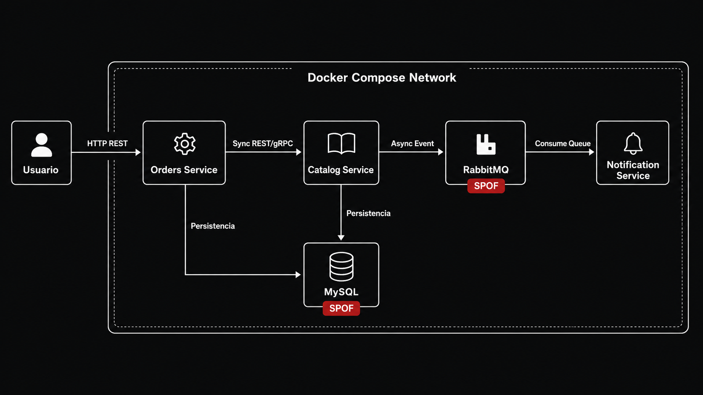

Armé una versión limpia y completa, corrigiendo el problema de formato que tenía tu sección `.proto` y dejando el IA Log dentro del README como pide la consigna. Está basada en tu README actual. 

Copiá y pegá TODO esto en `README.md`:

````md
# TP2 — Arquitectura de Microservicios para Market-Place-Inc

## Sistemas Distribuidos — TP2

## Integrantes

- Ezequiel Castro Burgos
- Emmanuel Orozco

---

# Introducción

Este trabajo práctico tiene como objetivo transformar una arquitectura monolítica en una arquitectura basada en microservicios utilizando tecnologías modernas de sistemas distribuidos.

El caso de estudio corresponde a **Market-Place-Inc**, una plataforma de e-commerce que originalmente presentaba problemas de escalabilidad, acoplamiento y fallas en cascada durante eventos de alta concurrencia, como el Hot Sale.

A partir de esta problemática se desarrolló una solución basada en:

- separación de servicios,
- contenedorización,
- comunicación síncrona entre servicios,
- mensajería asíncrona,
- orquestación básica,
- persistencia con base de datos,
- y desacoplamiento entre módulos.

---

# Objetivos del TP

- Separar funcionalidades del monolito en microservicios independientes.
- Implementar comunicación síncrona y asíncrona.
- Utilizar Docker y Docker Compose para la ejecución distribuida.
- Incorporar RabbitMQ como broker de mensajería.
- Simular un entorno distribuido con múltiples servicios.
- Documentar un contrato `.proto` para comunicación gRPC.
- Incluir manifiestos básicos de Kubernetes.
- Identificar puntos únicos de falla.
- Comprender problemas reales de sistemas distribuidos.

---

# Arquitectura del Sistema

La arquitectura implementada se compone de los siguientes servicios:

| Servicio | Responsabilidad |
| :--- | :--- |
| Catalog Service | Gestión y consulta de productos |
| Orders Service | Creación de pedidos |
| RabbitMQ | Broker de mensajería |
| MySQL | Persistencia de datos |
| Notification Service | Consumo de eventos asincrónicos |
| Payments Service | Servicio preparado para lógica de pagos |

---

## Diagrama de arquitectura

El sistema se ejecuta dentro de una red de Docker Compose. La arquitectura combina comunicación síncrona entre servicios y comunicación asíncrona mediante RabbitMQ.



---

## SPOFs identificados

Se identificaron los siguientes puntos únicos de falla (**SPOF**, Single Point of Failure):

- **MySQL**: si la base de datos se cae, los servicios que dependen de persistencia no pueden consultar ni guardar información.
- **RabbitMQ**: si el broker falla, la comunicación asíncrona se interrumpe y los eventos dejan de publicarse o consumirse.

Estos componentes son críticos porque en esta implementación académica no cuentan con redundancia ni alta disponibilidad.

---

# Comunicación entre Servicios

## Comunicación síncrona

La comunicación síncrona ocurre cuando un servicio necesita una respuesta inmediata de otro servicio para continuar su operación.

En este proyecto, el flujo principal síncrono es:

```text
Usuario → Orders Service → Catalog Service
```

Características:

- request-response,
- dependencia inmediata,
- bloqueo hasta obtener respuesta,
- menor complejidad inicial,
- mayor acoplamiento temporal.

---

## Comunicación asíncrona

La comunicación asíncrona se implementó mediante RabbitMQ.

Flujo:

```text
Orders Service → RabbitMQ → Notification Service
```

Funcionamiento:

1. Orders Service crea el pedido.
2. Orders Service publica un evento en RabbitMQ.
3. RabbitMQ almacena el mensaje en la cola `orders`.
4. Notification Service consume el mensaje de forma desacoplada.

Ventajas:

- desacoplamiento,
- resiliencia,
- tolerancia a fallos,
- procesamiento en background,
- menor impacto de latencia,
- posibilidad de procesar eventos aunque el consumidor no esté activo en ese momento.

---

## Comunicación síncrona vs asíncrona

| Flujo | Tipo | Tecnología | Justificación |
| :--- | :--- | :--- | :--- |
| Usuario → Orders Service | Síncrona | HTTP REST | El usuario necesita una respuesta inmediata al crear un pedido. |
| Orders Service → Catalog Service | Síncrona | REST / gRPC documentado | Orders necesita consultar el producto antes de confirmar el pedido. |
| Orders Service → RabbitMQ | Asíncrona | RabbitMQ | El evento del pedido se publica sin bloquear el request principal. |
| RabbitMQ → Notification Service | Asíncrona | Cola de mensajes | El consumidor procesa mensajes desacoplado del flujo principal. |

---

# Tecnologías Utilizadas

| Tecnología | Uso |
| :--- | :--- |
| Python | Lenguaje principal |
| FastAPI | Framework backend |
| Docker | Contenedores |
| Docker Compose | Orquestación local |
| RabbitMQ | Broker de mensajería |
| MySQL | Base de datos |
| SQLAlchemy | ORM |
| aiomysql | Driver asincrónico para MySQL |
| Pika | Cliente RabbitMQ |
| Kubernetes | Orquestación |
| gRPC / Protobuf | Contrato de comunicación entre servicios |
| Swagger / OpenAPI | Documentación de APIs |
| Locust | Pruebas de carga |

---

# Contrato gRPC / Protobuf

El proyecto incluye un archivo `.proto` para documentar el contrato de comunicación entre servicios.

El archivo se encuentra en:

```text
grpc/catalog.proto
```

Este contrato permite definir una interfaz clara y tipada para comunicación entre servicios.

## Comando de generación

Para generar los archivos Python a partir del contrato `.proto`, se puede utilizar el siguiente comando:

```bash
python -m grpc_tools.protoc -I./grpc --python_out=. --grpc_python_out=. ./grpc/catalog.proto
```

Este comando toma como entrada el archivo `catalog.proto` y genera el código necesario para usar gRPC desde Python.

---

# Estructura del Proyecto

```text
tp1-market-place-main/
│
├── catalog/
│   ├── api/
│   ├── database/
│   ├── models/
│   ├── app.py
│   └── Dockerfile
│
├── orders/
│   ├── api/
│   ├── database/
│   ├── models/
│   ├── services/
│   ├── app.py
│   └── Dockerfile
│
├── notificaciones/
│   ├── services/
│   └── Dockerfile
│
├── payments/
│   ├── api/
│   ├── config/
│   ├── database/
│   ├── models/
│   └── services/
│
├── events/
│   ├── connection.py
│   ├── contracts.py
│   └── publisher.py
│
├── grpc/
│   └── catalog.proto
│
├── k8s/
│   ├── orders-deployment.yaml
│   ├── orders-service.yaml
│   └── rabbitmq.yaml
│
├── tests/
├── docs/
│   └── arquitectura.png
│
├── docker-compose.yml
├── requirements.txt
├── INFORME_TP2.md
└── README.md
```

---

# Ejecución del Proyecto

## Requisitos

- Docker Desktop instalado y en ejecución.
- Docker Compose.
- Python 3.11 o superior.
- Opcional: Kubernetes habilitado en Docker Desktop para probar manifiestos K8s.

---

## Levantar el entorno

Desde la raíz del proyecto:

```bash
docker compose up --build
```

Este comando construye las imágenes y levanta los servicios definidos en `docker-compose.yml`.

---

## Detener el entorno

```bash
docker compose down
```

---

# Servicios Disponibles

| Servicio | URL |
| :--- | :--- |
| Orders Service | http://localhost:8000/docs |
| Catalog Service | http://localhost:8001/docs |
| RabbitMQ Dashboard | http://localhost:15672 |

---

# Credenciales RabbitMQ

```text
usuario: guest
password: guest
```

---

# Ejemplo de Flujo End-to-End

## 1. Crear pedido

Endpoint:

```http
POST /orders
```

Body:

```json
{
  "product_id": 1,
  "quantity": 1
}
```

---

## 2. Respuesta esperada

```json
{
  "message": "Pedido creado",
  "order_id": "...",
  "event_sent": true
}
```

---

## 3. Verificar RabbitMQ

Ingresar a:

```text
http://localhost:15672
```

Luego ir a:

```text
Queues and Streams → orders
```

Si el flujo fue exitoso, se debe observar un mensaje en la cola `orders`.

---

# Scripts de Demo

## Crear un pedido con curl

### Windows PowerShell

```powershell
curl.exe -X POST http://localhost:8000/orders `
  -H "Content-Type: application/json" `
  -d "{\"product_id\":1,\"quantity\":1}"
```

### Git Bash / Linux / macOS

```bash
curl -X POST http://localhost:8000/orders \
  -H "Content-Type: application/json" \
  -d '{"product_id":1,"quantity":1}'
```

---

## Ver contenedores activos

```bash
docker compose ps
```

---

## Ver logs del sistema

```bash
docker compose logs -f
```

---

## Ver cola en RabbitMQ

Abrir en navegador:

```text
http://localhost:15672
```

Credenciales:

```text
usuario: guest
password: guest
```

Luego ingresar a:

```text
Queues and Streams → orders
```

---

## Simular falla de un contenedor

Para probar reinicio automático de un contenedor:

```bash
docker kill tp1-market-place-main-catalog-1
```

Luego verificar el estado:

```bash
docker compose ps
```

---

# Docker y Contenedores

Cada microservicio posee su propio:

- Dockerfile,
- proceso independiente,
- entorno aislado,
- dependencias específicas.

Docker Compose permite:

- levantar todos los servicios,
- crear una red interna,
- comunicar contenedores por nombre de servicio,
- administrar dependencias,
- simplificar el entorno distribuido.

Un punto importante del desarrollo fue reemplazar `localhost` por nombres de servicio internos, por ejemplo:

```text
mysql
rabbitmq
catalog
```

Dentro de Docker Compose, `localhost` representa el propio contenedor, no la máquina host ni otro servicio.

---

# Kubernetes

El proyecto incluye manifiestos básicos de Kubernetes dentro de la carpeta:

```text
k8s/
```

Se incluyen recursos como:

- Deployment,
- Service,
- manifiesto para RabbitMQ.

Conceptos aplicados:

- service discovery,
- self-healing,
- separación de pods,
- comunicación interna,
- despliegue declarativo.

---

## Comandos Kubernetes

Aplicar los manifiestos:

```bash
kubectl apply -f k8s/
```

Ver pods:

```bash
kubectl get pods
```

Ver services:

```bash
kubectl get services
```

Eliminar un pod para probar self-healing:

```bash
kubectl delete pod <nombre-del-pod>
```

Verificar que Kubernetes lo recrea:

```bash
kubectl get pods
```

---

# Validación End-to-End

Se validó el flujo completo del sistema:

1. El usuario envía un `POST /orders`.
2. Orders Service recibe el pedido.
3. Orders Service consulta el catálogo.
4. Se genera el pedido.
5. Se publica un evento en RabbitMQ.
6. El mensaje queda visible en la cola `orders`.
7. El sistema confirma la creación del pedido mediante respuesta HTTP.

Esto demuestra integración entre servicios, persistencia y comunicación asíncrona.

---

# Problemas Encontrados y Soluciones

## 1. Dockerfiles vacíos o incompletos

Problema:

- Docker Compose no podía construir imágenes porque algunos Dockerfiles estaban vacíos o no existían.

Solución:

- Se crearon Dockerfiles individuales para cada microservicio.
- Se corrigieron las rutas de build en `docker-compose.yml`.

---

## 2. Error con dependencias RabbitMQ

Problema:

- El servicio de órdenes fallaba porque no encontraba el módulo `pika`.

Solución:

- Se agregó `pika` al archivo `requirements.txt`.
- Se reconstruyeron las imágenes Docker.

---

## 3. Conexión MySQL entre contenedores

Problema:

- Los servicios intentaban conectarse a MySQL usando `localhost`.

Solución:

- Se reemplazó `localhost` por el hostname interno de Docker Compose:

```text
mysql
```

---

## 4. Error de autenticación MySQL

Problema:

- SQLAlchemy intentaba conectarse sin contraseña o con credenciales incorrectas.

Solución:

- Se corrigió la URL de conexión agregando usuario y contraseña:

```text
root:root
```

---

## 5. Dependencia `cryptography`

Problema:

- MySQL 8 utiliza mecanismos modernos de autenticación que requieren soporte adicional desde Python.

Solución:

- Se agregó `cryptography` a `requirements.txt`.

---

## 6. Orden de inicio de servicios

Problema:

- Algunos servicios intentaban conectarse a MySQL antes de que la base de datos terminara de iniciar.

Solución:

- Se agregó `depends_on`.
- Se configuró reinicio automático con `restart: always`.
- Se agregó healthcheck para mejorar la espera de MySQL.

---

# Conceptos de Sistemas Distribuidos Aplicados

Durante el desarrollo se trabajó con:

- desacoplamiento,
- colas de mensajes,
- comunicación síncrona,
- comunicación asíncrona,
- contenedorización,
- fallas distribuidas,
- service discovery,
- aislamiento de servicios,
- resiliencia,
- arquitectura basada en eventos,
- puntos únicos de falla,
- debugging distribuido.

---

# Limitaciones de la Implementación

Esta implementación corresponde a un entorno académico y local. Algunas limitaciones actuales son:

- MySQL y RabbitMQ se ejecutan como instancias únicas, por lo que siguen siendo SPOFs.
- No se implementó alta disponibilidad real.
- No se implementó autenticación entre servicios.
- Kubernetes se incluye con manifiestos básicos.
- El sistema prioriza mostrar comunicación distribuida, contenedores y mensajería antes que cubrir todos los casos productivos.
- La observabilidad se encuentra documentada y parcialmente estructurada, pero no se implementó un stack completo como Prometheus, Grafana o Jaeger.

---

# IA Log: Registro de Interacciones y Correcciones

## Introducción

Este apartado registra las interacciones clave con el asistente de IA durante el desarrollo del TP2, destacando los errores detectados y las decisiones arquitectónicas tomadas para garantizar la calidad, resiliencia y funcionamiento del sistema distribuido.

## Uso de IA durante el desarrollo

La IA fue utilizada como herramienta de apoyo para:

- diagnóstico de errores Docker,
- configuración de RabbitMQ,
- debugging de networking entre contenedores,
- generación de documentación,
- comprensión conceptual de microservicios,
- análisis de problemas de comunicación distribuida.

---

## Registro de Interacciones Críticas

| Fecha | Tarea | Error detectado por la IA / Humano | Corrección aplicada |
| :--- | :--- | :--- | :--- |
| 02/05 | Fase 3 Pagos | Inconsistencia: Modelo `Payment` con Integer ID vs `PaymentService` con UUID string. | Se modificó el modelo `Payment` para aceptar String UUID y mantener consistencia en sistemas distribuidos. |
| 02/05 | Fase 3 Pagos | Consultas SQL crudas fallaban con `MissingGreenlet` y uso incorrecto de `select(Payment)`. | Se refactorizó la capa de persistencia para utilizar `select(Payment)` de SQLAlchemy correctamente en contexto asíncrono. |
| 02/05 | Fase 3 Pagos | El `webhook_handler` no inyectaba la sesión de DB porque faltaba `Depends(get_db)`. | Se inyectó la dependencia `db: AsyncSession` correctamente en el handler. |
| 02/05 | Integración | Conflicto de rutas: `main.py` y `orders/api/orders.py` registraban la misma ruta `/orders`. | Se limpió `main.py`, eliminando lógica antigua y delegando exclusivamente al router de `orders`. |
| 12/05 | Docker Compose | Los servicios no iniciaban porque algunos Dockerfiles estaban vacíos o ausentes. | Se crearon Dockerfiles individuales para cada microservicio y se corrigieron rutas de build en `docker-compose.yml`. |
| 12/05 | Networking Docker | Los contenedores intentaban conectarse utilizando `localhost`, provocando errores de conexión entre servicios. | Se reemplazó `localhost` por hostnames internos como `mysql` y `rabbitmq`. |
| 12/05 | RabbitMQ | El contenedor de órdenes fallaba por ausencia del módulo `pika`. | Se agregó `pika` a `requirements.txt` y se reconstruyeron las imágenes Docker. |
| 12/05 | Persistencia MySQL | SQLAlchemy no podía autenticarse contra MySQL con el usuario `root`. | Se corrigió la URL de conexión agregando usuario y contraseña `root:root`. |
| 12/05 | Dependencias Python | `aiomysql` requería el paquete `cryptography` para autenticación moderna de MySQL 8. | Se agregó `cryptography` a `requirements.txt`. |
| 12/05 | Startup distribuido | Los servicios intentaban conectarse a MySQL antes de que el contenedor terminara de iniciar. | Se implementó `healthcheck`, `depends_on` y `restart: always` en Docker Compose. |
| 12/05 | RabbitMQ | Se necesitaba validar persistencia y desacoplamiento de mensajes. | Se probó el flujo end-to-end mediante `POST /orders`, verificando la cola `orders` en RabbitMQ Dashboard. |

---

## Aprendizajes

1. **Idempotencia:** la IA suele omitirla por defecto en consumers. Es obligatorio verificarla en flujos asíncronos.
2. **Timeouts:** es fundamental configurar timeouts explícitos en llamadas síncronas entre servicios para evitar cascading failures.
3. **Tipado:** en sistemas distribuidos, la inconsistencia entre UUIDs e Integers puede romper la persistencia y el tracing.
4. **Networking distribuido:** dentro de Docker Compose los servicios se comunican mediante DNS interno y no mediante `localhost`.
5. **Startup order:** el orden de inicio de servicios es crítico. Un servicio puede fallar aunque la configuración sea correcta si la dependencia todavía no terminó de iniciar.
6. **Mensajería asíncrona:** RabbitMQ permite desacoplar productores y consumidores, aumentando resiliencia y tolerancia a fallos.
7. **Debugging distribuido:** diagnosticar problemas en microservicios es más complejo que en un monolito debido a networking, contenedores, logs separados y sincronización entre servicios.
8. **Supervisión humana:** la IA fue útil para orientar el diagnóstico, pero varias correcciones requirieron validación manual, ejecución real y revisión de logs.

---

# Conclusión

El trabajo permitió comprender las diferencias entre una arquitectura monolítica y una arquitectura basada en microservicios.

La implementación mostró ventajas importantes:

- desacoplamiento,
- escalabilidad,
- resiliencia,
- separación de responsabilidades,
- posibilidad de procesamiento asíncrono,
- independencia parcial entre servicios.

También se observaron nuevas complejidades:

- networking distribuido,
- sincronización entre servicios,
- dependencias entre contenedores,
- manejo de colas,
- debugging distribuido,
- necesidad de observabilidad,
- identificación de puntos únicos de falla.

Finalmente, el TP permitió aplicar herramientas modernas utilizadas en entornos reales de desarrollo distribuido y DevOps, como Docker, Docker Compose, RabbitMQ, FastAPI, MySQL, gRPC y Kubernetes.

````
